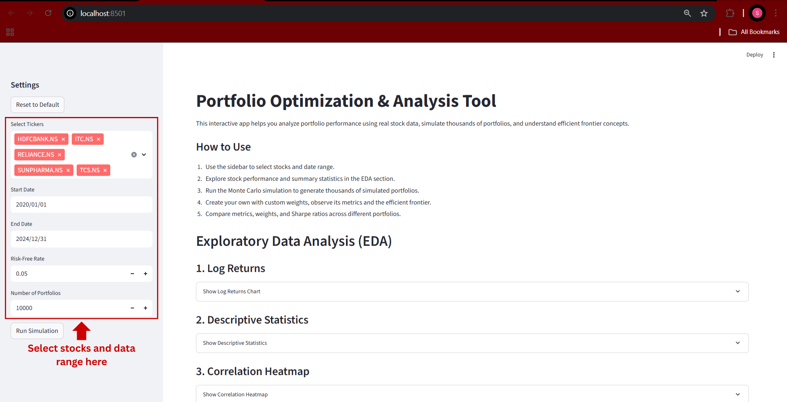
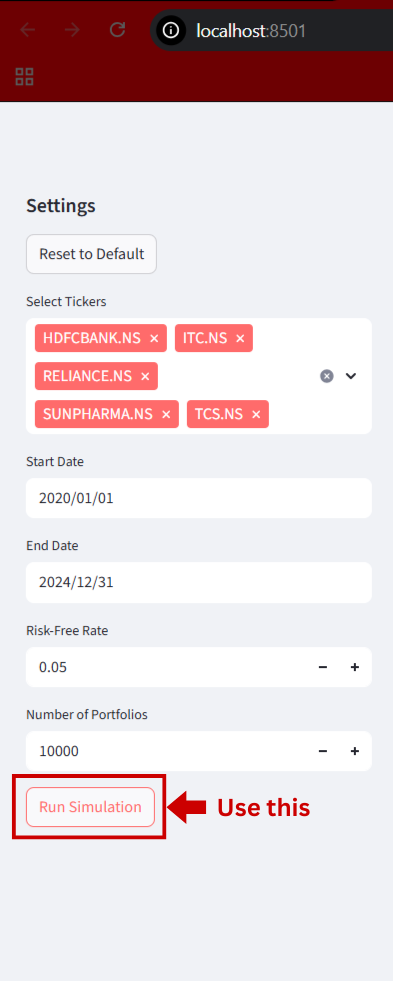
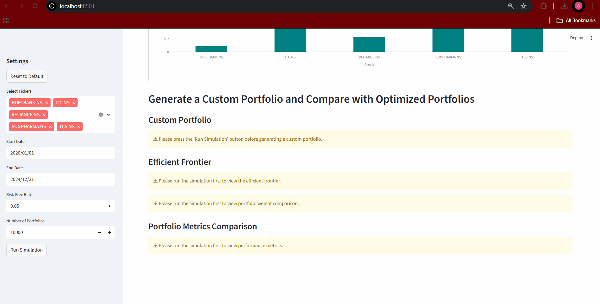
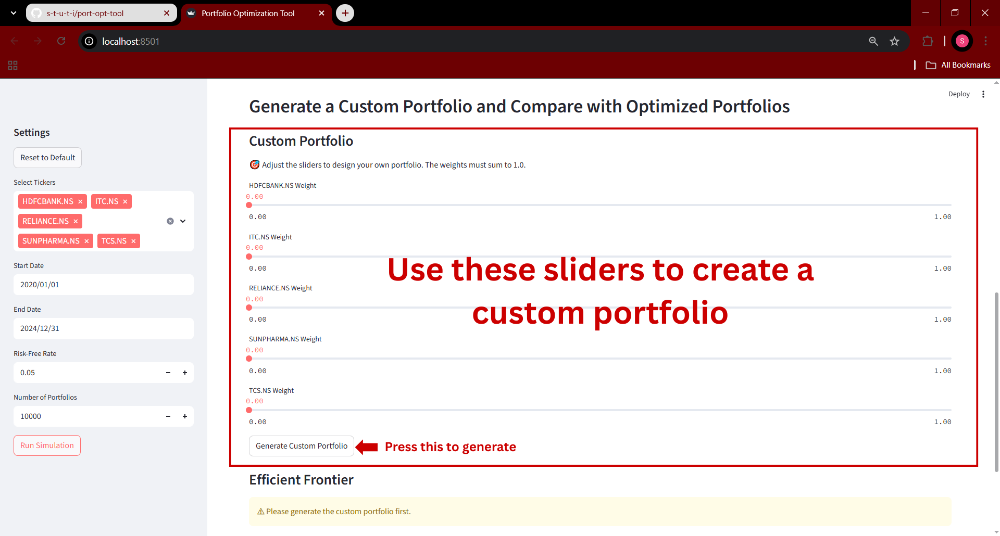
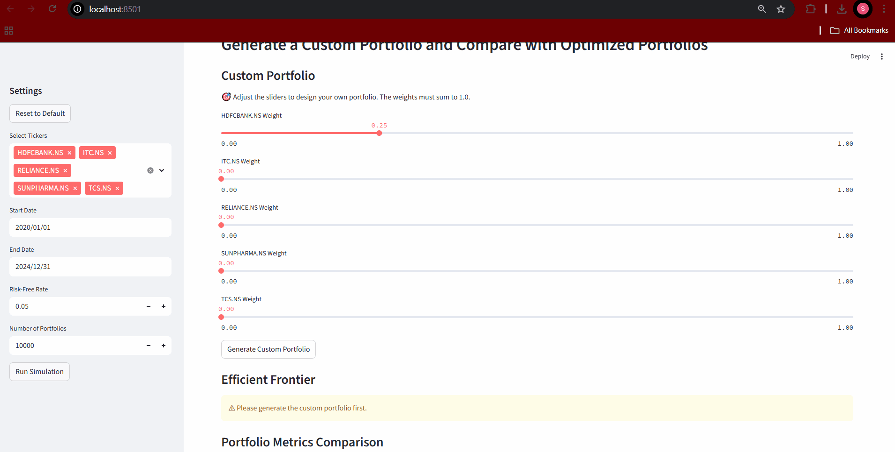
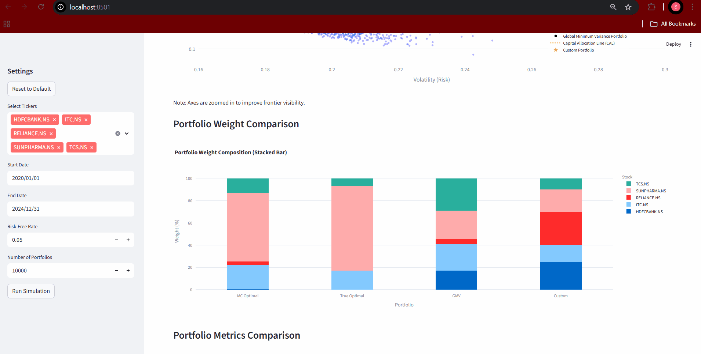

# Portfolio Optimization and Analysis Tool

## Project Description

Portfolio Optimization & Analysis Tool is an interactive Streamlit application that enables users to analyze stock data, simulate portfolio performance, and build optimized investment strategies using quantitative finance techniques.

This tool fetches real stock market data, performs detailed exploratory analysis, and allows users to simulate thousands of portfolios using Monte Carlo methods. It also applies mathematical optimization to compute portfolios that maximize the Sharpe ratio and minimize volatility (GMV portfolios).

A unique feature is the custom portfolio builder, where users can create their own portfolio by adjusting weights and instantly compare its performance with optimized portfolios using dynamic charts and metrics.

This app provides an educational and hands-on environment to learn about portfolio theory and risk-return trade-offs.

This tool combines real-time financial data from Yahoo Finance with quantitative techniques implemented using Python libraries like NumPy, SciPy, Pandas, and Plotly, all wrapped in an interactive Streamlit interface.

## Project Purpose
The purpose of this project is to help users better understand how portfolio construction works in practice. I wanted to build an interactive tool that allows someone to analyze a set of stocks, simulate possible portfolios, and compare different optimization strategies - like Monte Carlo simulations, minimum variance, sharpe ratio maximization, and even a custom portfolio with user - defined weights.

The idea was to make portfolio theory tangible - by showing how changes in asset allocation affects risk, return and efficiency. It's meant purely for analysis and educational insights, not for real - world investment decisions.

## How to Install and Run the Project

1. Clone the repository
   Download the project files to your local machine.

```bash 
git clone https://github.com/s-t-u-t-i/port-opt-tool.git
cd port_opt_tool
```

2. Create and activate a virtual environment(Optional but recommended)
   Helps isolate the project and avoid conflicts with other Python packages.

```bash
# Create a virtual environment
python -m venv venv

# Activate it
# On Windows:
venv\Scripts\activate

# On macOS/Linux:
source venv/bin/activate
```

OR If you're using conda, you can use:

```bash
conda create --name portopt python=3.10
conda activate portopt
```

3. Install Dependencies
   Install all required Python libraries.

```bash
pip install -r requirements.txt
```
**Note**: This project uses `curl_cffi` to simulate browser-like requests and avoid being blocked by Yahoo Finance during data download. This ensures smoother and more reliable access to stock price data.


4. Run the Streamlit App
   Launch the interactive app in your browser.

```bash
streamlit run streamlit_app.py
```

After running, visit: http://localhost:8501

## How to Use

   Once the app is running, follow these steps to explore portfolio optimization:

1. Select Stocks and Date Range

  Use the sidebar to:
   - Choose from the list of 5 available stocks.
   - Set a custom start and end date.
   - Adjust the number of portfolios to simulate.
   - Define the annual risk-free rate.
   - 

2. Explore Data in the EDA Section
  
  After stock selection and data range you can:
   - View log returns of selected stocks
   - Examine descriptive statistics
   - Analyze correlation heatmaps
   - Compare individual Sharpe ratios using interactive charts
   - 

3. Run Portfolio Simulation followed by creating a Custom portfolio

  Click the "Run Simulation" button to:
   - Generate thousands of random portfolios
   - Calculate their expected returns, risks, and Sharpe ratios
   - Identify the Monte Carlo optimal portfolio (highest Sharpe)
   - 
   - 

  Then Create a Custom Portfolio using sliders to assign weights to each selected stock
   - Make sure the total weights sum to 1.0
   - Click "Generate Custom Portfolio" to compute and observe its metrics
   - 
   - 

5. Analyze Optimized Portfolios

  After generating your custom portfolio you can examine the Efficient frontier to view the following:
   - Minimum variance portfolio (GMV)
   - Maximum Sharpe ratio portfolio (True Optimal)
   - Monte Carlo simulated portfolios
   - Monte Carlo Optimal portfolio
   - Custom generated portfolio
   - Capital Allocation Line (CAL)
   - 

6. Compare Portfolios

  Lastly you can use the iteractive bar charts displayed to compare:
   - Weight compositions across MC Optimal, True Optimal, GMV, and Custom
   - Return, Volatility, and Sharpe Ratio comparison for the same.
   - 

**Notes**:
 - The efficient frontier graph is zoomed in for better visibility of various portfolios.
 - Custom portfolio must be generated after running the simulation.

## Credits

This project was developed by Stuti Singh as part of a portfolio showcasing quantitative finance, data analysis, and interactive visualization skills using Python and Streamlit.

Special thanks to:
- The open-source Python community and contributors of libraries such as:
-- pandas, numpy, scipy, matplotlib, plotly, and streamlit
- Online resources and documentation that supported the development process
----
